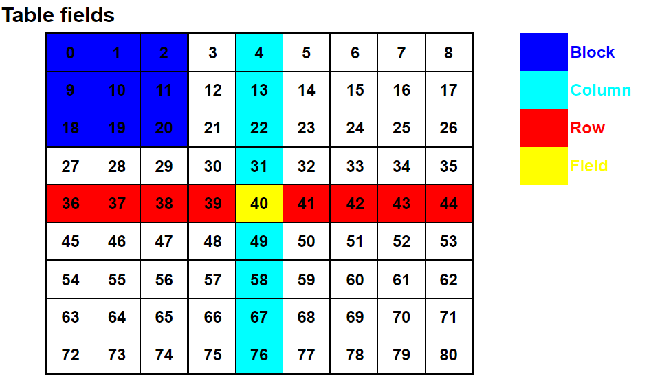
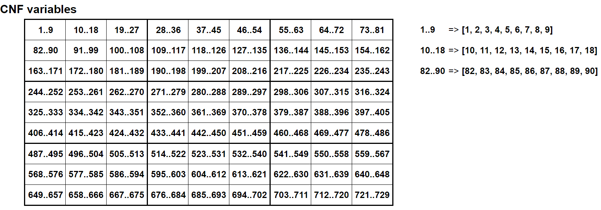
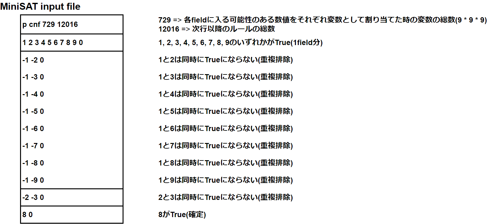
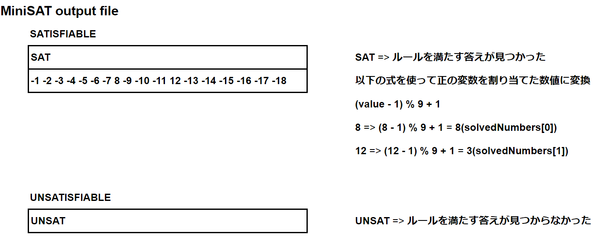

# NumberPlaceSolver
SATソルバーを利用した数独(ナンプレ)の答えを見つけるスクリプト

## SATソルバーを利用する経緯
- [任天堂株式会社のソフトウェアエンジニア向けキャリア採用ページ](https://www.nintendo.co.jp/jobs/career/index.html)の参考課題として公開されていたRuby版コードパズル(decode the answer)の最終問題で25x25の数独(ナンプレ)の答えを見つける必要があった
  - 2024年3月頃までは公開されていたが2024年5月現在は非公開
- 自作アルゴリズムで答えを見つけようとしたが、組み合わせ爆発で時間がかかりすぎる
- 数独(ナンプレ)の解析手法についてWeb検索したところ、SATソルバーを利用することで一瞬で答えを見つけられることがわかったので採用

## MiniSAT(SATソルバー)のビルド
**Tim Bersama**さんの[ページ](https://medium.com/@timbersama2020/minisat-installation-guide-efb99a897138)を参考にビルド

### リポジトリをクローン
```
git clone https://github.com/master-keying/minisat.git
```

### [CMake](https://cmake.org/download/)のインストール

### Windows環境でビルド

1. [Visual Studio](https://visualstudio.microsoft.com/ja/downloads/)のインストール

1. Visual Studio 2022でビルド
```
cd minisat
mkdir build && cd build
cmake -G "Visual Studio 17 2022" ..
cmake --build .
```

## 使い方
### Ruby
```
require "./NumberPlaceSolver.rb"

def str2ary(string)
  string.delete("\n").each_char.each_with_object([]){|c, object| object << c.to_i}
end

inputNumbers = str2ary(<<NUMBERS)
800005100
001000800
040200090
000030002
123406789
600010000
080009050
002000400
007600001
NUMBERS

solvedNumbers = NumberPlaceSolver::SatSolver.new(inputNumbers).Solve("cnf.txt", "solved.txt"){|cnfFilePath, solvedFilePath|
  # MiniSATのビルド環境に合わせて実行パスを変える
  `../minisat/build/Debug/minisat.exe #{cnfFilePath} #{solvedFilePath}`
}

puts solvedNumbers.ToTableString(" | ")
=begin
8 | 3 | 9 | 7 | 6 | 5 | 1 | 2 | 4
2 | 6 | 1 | 3 | 9 | 4 | 8 | 7 | 5
7 | 4 | 5 | 2 | 8 | 1 | 3 | 9 | 6
5 | 9 | 4 | 8 | 3 | 7 | 6 | 1 | 2
1 | 2 | 3 | 4 | 5 | 6 | 7 | 8 | 9
6 | 7 | 8 | 9 | 1 | 2 | 5 | 4 | 3
3 | 8 | 6 | 1 | 4 | 9 | 2 | 5 | 7
9 | 1 | 2 | 5 | 7 | 3 | 4 | 6 | 8
4 | 5 | 7 | 6 | 2 | 8 | 9 | 3 | 1
=end
File.write("solved.tsv", solvedNumbers.ToTableString("\t"))
=begin
8	3	9	7	6	5	1	2	4
2	6	1	3	9	4	8	7	5
7	4	5	2	8	1	3	9	6
5	9	4	8	3	7	6	1	2
1	2	3	4	5	6	7	8	9
6	7	8	9	1	2	5	4	3
3	8	6	1	4	9	2	5	7
9	1	2	5	7	3	4	6	8
4	5	7	6	2	8	9	3	1
=end
```

## 概念図
- 1次元配列をテーブルと想定


- CNFの定義に必要な各fieldに入る可能性のある数値をそれぞれ変数として割り当てる


- MiniSATファイル


